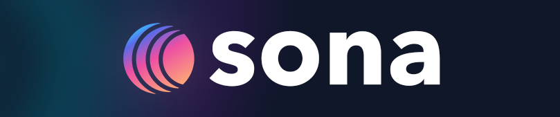

<a id="readme-top"></a>

<br />
<div align="center">
  <a href="https://github.com/rinderhackzilla/sona">
    
  </a>

  <h3 align="center">Sona</h3>
  <p align="center">
    A modern Windows desktop music client for Navidrome/Subsonic servers built with React and Electron.
    <br />
    <br />
    Forked from <a href="https://github.com/victoralvesf/aonsoku">Aonsoku</a>
  </p>

  [![React][React.js]][React-url] [![Electron][Electron]][Electron-url]
</div>

<details open>
  <summary>Table of Contents</summary>
  <ol>
    <li><a href="#about-sona">About Sona</a></li>
    <li><a href="#download--installation">Download & Installation</a></li>
    <li><a href="#features">Features</a></li>
    <li><a href="#screenshots">Screenshots</a></li>
    <li><a href="#setup-guides">Setup Guides</a>
      <ul>
        <li><a href="#lidarr-integration-setup">Lidarr Integration Setup</a></li>
      </ul>
    </li>
    <li><a href="#development--building">Development & Building</a></li>
    <li><a href="#developer-notes">Developer Notes</a></li>
    <li><a href="#license">License</a></li>
  </ol>
</details>

## About Sona

Sona is a desktop music client for Subsonic-compatible servers (such as Navidrome), customized and enhanced for Windows. It focuses on a clean, modern interface, advanced audio control, and smart music discovery.

<p align="right">(<a href="#readme-top">back to top</a>)</p>

## Download & Installation

Sona is distributed as a ready-to-run Windows executable with built-in auto-updates.

1. **Download:** Grab the latest installer (`Sona-Setup-*.exe`) or portable executable from the **[Releases](https://github.com/rinderhackzilla/sona/releases)** page.
2. **Install:** Run the installer and launch **Sona**.
3. **Connect:** Enter your Subsonic/Navidrome server URL, username, and password on the login screen.

> **Note:** Once installed, Sona will automatically check for future updates and allow you to update directly within the app (or manually via **Settings → About**).

<p align="right">(<a href="#readme-top">back to top</a>)</p>

## Features

### Core Experience
- **Subsonic & Navidrome Integration:** Full library browsing, instant search, and streaming from your personal music server.
- **In-App Auto-Updates:** Seamless update notifications and one-click installation for new GitHub releases.
- **Customizable Home Dashboard:** Modular dashboard with customizable slots (Discover Daily, Session Vibe, Daytime Mood, Top Genres, On This Day anniversaries, This Is Artist).
- **Intuitive UI:** Modern, clean, and responsive design following a unified design-token system.
- **Fullscreen Player:** Dedicated fullscreen scene with queue, lyrics, now-playing details, animated backdrops, and cover art visualizers.
- **Mini Player Mode:** Compact always-on-top player for background listening.
- **Session Modes:** One-click listening moods:
  - **Focus:** Distraction-free, minimal interface.
  - **Night:** Atmospheric, high-contrast neon theme.
- **Sona DJ Modes:** Smart queue injection for dynamic listening sessions:
  - **Wildcard:** Spontaneous musical detours between queued tracks.
  - **Drift:** Keeps the current vibe and genre flowing smoothly.
  - **Timekeeper:** Stays within a cohesive musical era or decade.
- **Synchronized & Embedded Lyrics:** Automatic synced lyrics lookup via LRCLIB with fallback to embedded tags.
- **Internet Radio:** Play and manage custom radio streams.
- **Scrobble & Offline Queue:** Sync playback with your server and Last.fm, with an automatic offline retry queue during connection drops.
- **Discord Rich Presence:** Showcase current track, album art, and playback progress to Discord.

### Audio Engine & Performance
- **Ultra-Low CPU Usage:** Throttled render loop and background animation pausing for efficient playback on laptops and desktops.
- **Audio Visualizers:** Real-time audio waveform and bar visualizers.
- **Equalizer:** Built-in 8-band graphic equalizer with curated genre presets and custom gain adjustments.
- **Crossfade Playback:** Smooth transitions between consecutive tracks.

### Music Discovery & Playlists
- **Discover Daily / Weekly:** Personalized recommendations powered by your Last.fm history and local library matches.
- **Daytime Mood Mix:** Continuous, time-of-day adapted mix (Morning, Afternoon, Evening, Night) with mood-aware track selection.
- **Rabbit Hole:** Instant 50-song discovery queue generated from similar artists.
- **Your Top 50:** Your 50 most-played tracks of the past year, synced and updated automatically.
- **This Is [Artist]:** Dynamic artist spotlights and curated deep dives.
- **Anniversary Spotlight ("On This Day"):** Discover albums celebrating release milestones today.

### Integrations
- **Lidarr Integration:** Search and request missing albums or artists directly from Sona via the Lidarr API.
- **Last.fm:** Scrobbling, similar artists mapping, and listening history integration.

<p align="right">(<a href="#readme-top">back to top</a>)</p>

## Screenshots

<a href="https://raw.githubusercontent.com/rinderhackzilla/sona/refs/heads/main/public/screenshots/start.jpg"></a> <a href="https://raw.githubusercontent.com/rinderhackzilla/sona/refs/heads/main/public/screenshots/top50.jpg"></a>

<a href="https://raw.githubusercontent.com/rinderhackzilla/sona/refs/heads/main/public/screenshots/discover.jpg"></a> <a href="https://raw.githubusercontent.com/rinderhackzilla/sona/refs/heads/main/public/screenshots/lyrics.jpg"></a>

<a href="https://raw.githubusercontent.com/rinderhackzilla/sona/refs/heads/main/public/screenshots/visualizer.jpg"></a> <a href="https://raw.githubusercontent.com/rinderhackzilla/sona/refs/heads/main/public/screenshots/eq.jpg"></a>

<p align="right">(<a href="#readme-top">back to top</a>)</p>

## Development & Building

If you wish to contribute or build Sona from source:

### Prerequisites
- Node.js (LTS recommended)
- npm or pnpm

### Setup & Run
```sh
# Clone repository
git clone https://github.com/rinderhackzilla/sona.git
cd sona

# Install dependencies
npm install

# Run in development mode
npm run electron:dev

# Build Windows installer (.exe)
npm run build:win
```

### Recommended IDE Setup
- [VS Code](https://code.visualstudio.com/) + [Biome](https://marketplace.visualstudio.com/items?itemName=biomejs.biome)

<p align="right">(<a href="#readme-top">back to top</a>)</p>

## Setup Guides


### Lidarr Integration Setup

Connect Sona directly to your Lidarr instance via API to request and download missing albums/artists.

#### Requirements
- **Lidarr Instance:** Running Lidarr server (v1.0.0 or higher)
- **API Key:** Lidarr API key with write permissions
- **Network Access:** Sona must be able to reach Lidarr (same network or via reverse proxy)

#### Configuration Steps

1. **Get Your Lidarr API Key:**
   - Open Lidarr web interface
   - Go to **Settings → General**
   - Scroll to **Security** section
   - Copy your **API Key**

2. **Configure Sona:**
   - Open Sona settings (⚙️ icon in sidebar)
   - Navigate to **Integrations** tab
   - Find the **Lidarr** section
   - Enter:
     - **Lidarr URL:** `http://192.168.0.163:8686` (or your Lidarr address)
     - **API Key:** Paste your API key
   - Click **Test Connection** to verify

3. **Using Lidarr Integration:**
   - Browse to any artist in Sona
   - If artist is not in your Lidarr library, you'll see **"Request via Lidarr"** button
   - Click to:
     - Add artist to Lidarr
     - Monitor for new releases
     - Trigger search for missing albums
   - Check Lidarr for download progress

4. **Lidarr Prerequisites:**
   
   Ensure Lidarr is properly configured:
   - **Quality Profiles:** At least one configured
   - **Root Folder:** Music library path set
   - **Indexers:** Configured for searching
   - **Download Client:** qBittorrent, Transmission, etc. set up

#### Troubleshooting

- **Connection Failed:**
  - Verify Lidarr URL includes protocol (`http://` or `https://`) and port
  - Test access: `curl http://YOUR_LIDARR_IP:8686/api/v1/system/status -H "X-Api-Key: YOUR_API_KEY"`
  - Check firewall/network settings
  - For HTTPS, ensure valid SSL certificate

- **API Errors:**
  - Regenerate API key in Lidarr if authentication fails
  - Check Lidarr logs: **System → Logs**
  - Ensure API key has not been revoked

- **Request Not Working:**
  - Verify quality profiles exist: **Settings → Profiles**
  - Check indexers are configured: **Settings → Indexers**
  - Ensure download client is set up: **Settings → Download Clients**
  - Review Lidarr activity: **Activity → Queue**

<p align="right">(<a href="#readme-top">back to top</a>)</p>

## Developer Notes

- Storage conventions and key ownership:
  - [`docs/architecture/storage.md`](docs/architecture/storage.md)

<p align="right">(<a href="#readme-top">back to top</a>)</p>

## License

Distributed under the MIT License. See `LICENSE.txt` for more information.

Original Aonsoku project by victoralvesf: https://github.com/victoralvesf/aonsoku

<p align="right">(<a href="#readme-top">back to top</a>)</p>

[React.js]: https://img.shields.io/badge/React-000000?style=for-the-badge&logo=react&logoColor=61DAFB
[React-url]: https://reactjs.org/
[Electron]: https://img.shields.io/badge/Electron-000000?style=for-the-badge&logo=electron&logoColor=9FEAF9
[Electron-url]: https://www.electronjs.org/
